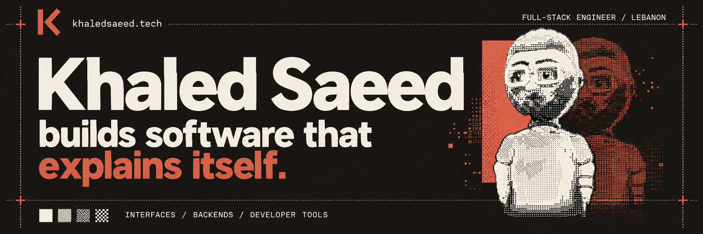

[](https://khaledsaeed.tech)

<p align="center">
  <a href="https://khaledsaeed.tech"></a>
</p>

# khaledsaeed.tech

Personal portfolio site, built with Next.js, React, TypeScript, and Tailwind CSS.

## What it is

This project powers [khaledsaeed.tech](https://khaledsaeed.tech). The whole site is designed as a 1-bit print run: square corners, a page frame with dotted rails and full-width rules crossed by registration marks, a 4x4 Bayer dither throughout, and projects printed on colored card stock with their own dithered 3D objects.

- `/` hero with the live dithered self-portrait, selected work as a press proof, the stack as a DIP-28 datasheet, writing as a broadsheet front page, and a reply postcard
- `/work` the job book (filterable ledger with a sticky proof) and `/work/[slug]` a case study per project
- `/about` bio, specifications and a run log of education and certifications
- `/writing` the back issues archive and `/writing/[slug]` articles pulled from DEV (canonical links point back to DEV)
- `/contact` the reply postcard and a profile directory with Beirut time
- `/llms.txt`, `/writing/rss.xml`, `/sitemap.xml`, `/robots.txt` for answer engines, readers and crawlers

Design and layout rules for contributors (square corners, the page frame, rails and rules, stacked headings) live in `AGENTS.md`.

## Tech Stack

- Next.js 16.3 (App Router, React view transitions)
- React 19
- TypeScript
- Tailwind CSS 4
- ESLint and Prettier

## Getting Started

```bash
pnpm install
pnpm dev
```

Open `http://localhost:3000` in your browser.

## Scripts

- `pnpm dev` start the local dev server
- `pnpm build` build the production app
- `pnpm start` start the production server
- `pnpm lint` run ESLint
- `pnpm format` format TypeScript files with Prettier
- `pnpm typecheck` run the TypeScript compiler without emitting output

## Content

Everything on the site is single-sourced in `lib/content`:

- `projects.ts` projects and case study copy
- `profile.ts` bio, education, credentials, stack (in pin order), principles

The public identity lives in `lib/site.ts`: `name` is Khaled Saeed and `username` is KhaledSaeed18. Page titles, profile structured data, visible identity links and `llms.txt` use those shared values. Keep platform-specific handles in `socialLinks` accurate; they do not all use the same spelling. Update `profileUpdatedAt` when the home/about profile changes significantly so their sitemap dates describe the content.

### Adding a project

1. Add an entry to `projects` in `lib/content/projects.ts` (copy rules: sentence case, no em dashes, no emoji). Set `featured: true` to put it on the home press; keep six featured.
   Set `updatedAt` to the ISO date (`YYYY-MM-DD`) when the case study's content changes significantly. This supplies stable sitemap and structured-data dates; pages without a recorded date omit it instead of using the deployment time.
2. Pick an existing `object`, or add a new one: a signed distance function in `components/studio/object-studio.tsx`, plus its name in `ObjectKind`, `lib/content/objects.ts` and `scripts/render-objects.mjs`.
3. With `pnpm dev` running, `node scripts/render-objects.mjs <object>` writes the sprite to `public/objects/` and the social card art to `public/og/<slug>.png`.
4. Everything else (work ledger, case study, sitemap, JSON-LD, llms.txt, project counts) follows from the entry. A new group also needs a place in `groupOrder`.

Shared article helpers (the tag kicker and the standfirst taken from an article's opening) are in `lib/writing.ts`.

Live data is fetched at build time and revalidated daily: articles from the DEV API (`lib/data/devto.ts`) and project star counts from GitHub (`lib/data/github.ts`). Set `GITHUB_TOKEN` for a higher GitHub rate limit; without it star counts are simply omitted.

## The dither system

- `app/dither.css` holds the 17 Bayer mask levels, the dithered tone helper, the object sprite animation, and the site's whole motion vocabulary: `fade-in`, `rise-in`, the scroll reveal (`data-reveal`) and the page-to-page crossfade.
- The scroll reveal only ever hides content below the fold (`components/print/reveal-observer.tsx`); anything on screen at load paints at once, so it never delays LCP.
- `components/dither-character.tsx` is the portrait: a signed distance field raymarched in one fragment shader, with adaptive quality tiers and a static fallback (`public/character.png`) when WebGL2 or hardware acceleration is missing.

### Project objects

Each project's object is a 16-frame, 1-bit sprite in `public/objects`, rendered from signed distance fields in the dev-only `/studio` route (`components/studio/object-studio.tsx`). To change or add one, edit the SDF there, then with `pnpm dev` running:

```bash
node scripts/render-objects.mjs          # all objects
node scripts/render-objects.mjs key cap  # only these
```

Useful dev-only query params on the home page: `?shade` (no dither), `?zoom` (head close-up), `?still` (skip the print-in), `?fallback` (the no-WebGL image), `?q=0|1|2` (force a quality tier).

## Details worth finding

- **Job ticket** (`components/keys/keyboard-layer.tsx`): ⌘K or `/` opens a command palette over pages, projects, articles and actions. `g h/w/a/r/c` navigate, `j`/`k` move through lists, `?` shows the key legend, `p` toggles proof mode (the 12-column grid, frame numbers and live type metrics over the page).
- **Résumé print** (`components/print/print-resume.tsx`): ⌘P on any page prints a one-page A4 résumé with crop marks.
- **Misprint 404** (`components/misprint/`): drag the terracotta plate back into register; the closest real pages are suggested. The same game lives at `/register`.
- **Console proof** (`components/console-proof.tsx`): DevTools shows the mark, `colophon()` and a byte puzzle that leads to `/register`.
- **Sleeping portrait**: between 01:00 and 07:00 Beirut time the portrait dozes; a click wakes him. `?sleep` forces it.
- **Save contact**: `/khaled-saeed.vcf` is a vCard with the portrait as its photo. The footer's edition is the build commit; articles show a reading ink bar.

## Production

- Security headers are set for every route in `next.config.ts`; the footer's "last printed" date is the build time (`BUILD_DATE`).
- `pnpm audit --prod` should stay clean; patched transitive versions are pinned under `overrides` in `pnpm-workspace.yaml`.
